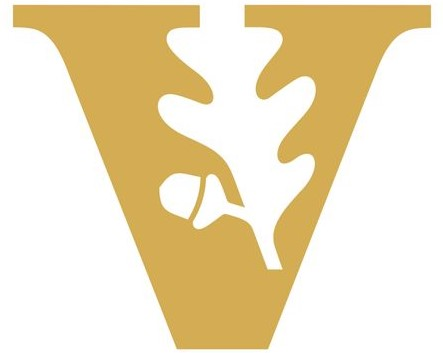
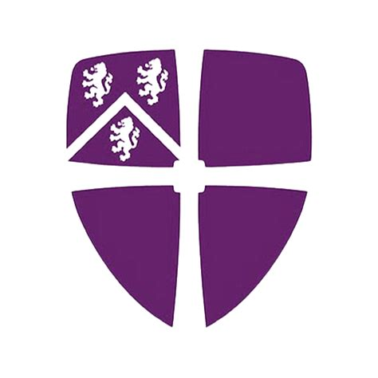
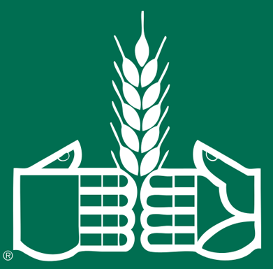

<!--
-->

 <h1 align = "center">Simon Ward: Portfolio </h1>
 
&emsp;&emsp;&emsp;&emsp;&emsp;&emsp;&emsp;&emsp;&emsp;&emsp;&emsp;&emsp;&emsp;&emsp;&emsp;&emsp;&emsp;&emsp;  

I am an applied data science researcher with prior industry experience eager to apply my knowledge of machine learning, statistical analysis, and other data science techniques to challenging and high impact business problems. I have a strong track record of leading teams of junior and senior colleagues, working on projects I curated and creating business value.

***

## Applied Machine Learning/Data Science Projects

Below are several data science projects, primarily focused on improving the performance (speed of response, stability, and sensitivity) of biosensors (sensors able to detect harmful biological molecules) for more effective medical diagnostics 🩺💉💊, food safety 🍇🍅🍌 and environmental monitoring 🌱🐟💧, to keep people around the world healthier and safer.

| ⏱️📈⏩ [Faster Sensor Response using Time Series Forecasting](https://github.com/SimonJWard/Response-Time-Reduction/tree/main#readme)| 👅🧠🔥 [Increased Sensor Stability using Machine Learning](https://github.com/SimonJWard/Capture-Agent-Free-Biosensing)|
| :-:| :-:| 
| | 

| 🔍🎯📏 [Enhanced Biosensor Detection Limits with Signal Processing](https://github.com/SimonJWard/Enhancing-Biosensor-Detection-Limits)| 💡🔀📚 [Inverse Design of Optical Structures using Deep Learning](https://github.com/SimonJWard/Optical-Structure-Inverse-Design)|
| :-:| :-:| 
| | 

***

## Resume 
For further details of my skills and experience, review the sections below, or see my resume:
📄 [__Simon-Ward-Resume__](https://github.com/SimonJWard/SimonJWard/blob/main/Resume_Simon_Ward.pdf)

***

## Education

&ensp;[__Vanderbilt University__](https://www.vanderbilt.edu/) (Nashville, TN)&emsp;&emsp;&emsp;&emsp;&emsp;&emsp;&emsp;&emsp;&emsp;&emsp;&emsp;&emsp;&emsp;&emsp;&emsp;&emsp;&emsp;&emsp;&emsp;&emsp;&emsp;&emsp;&emsp;&emsp;&emsp;&emsp;&emsp;&emsp;&emsp;&emsp;&emsp;&emsp;&emsp;&emsp;2019 - 2024 (February)

&emsp;&emsp;&ensp;__PhD in Electrical and Computer Engineering__

 

&ensp;[__Durham University__](https://www.durham.ac.uk/) (Durham, United Kingdom)&emsp;&emsp;&emsp;&emsp;&emsp;&emsp;&emsp;&emsp;&emsp;&emsp;&emsp;&emsp;&emsp;&emsp;&emsp;&emsp;&emsp;&emsp;&emsp;&emsp;&emsp;&emsp;&emsp;&emsp;&emsp;&emsp;&emsp;&emsp;&emsp;&emsp;&emsp;&emsp;&emsp;&emsp;&emsp;&emsp;2014 - 2015

&emsp;&emsp;__Masters of Physics__

 

&ensp;[__Durham University__](https://www.durham.ac.uk/) (Durham, UK)&emsp;&emsp;&emsp;&emsp;&emsp;&emsp;&emsp;&emsp;&emsp;&emsp;&emsp;&emsp;&emsp;&emsp;&emsp;&emsp;&emsp;&emsp;&emsp;&emsp;&emsp;&emsp;&emsp;&emsp;&emsp;&emsp;&emsp;&emsp;&emsp;&emsp;&emsp;&emsp;&emsp;&emsp;&emsp;&emsp;2011 - 2014

&emsp;&emsp;__Bachelors of Physics__

***

## Engineering Experience
 
__Research assistant__&emsp;&emsp;&emsp;&emsp;&emsp;&emsp;&emsp;&emsp;&emsp;&emsp;&emsp;&emsp;&emsp;&emsp;&emsp;&emsp;&emsp;&emsp;&emsp;&emsp;&emsp;&emsp;&emsp;&emsp;&emsp;&emsp;&emsp;&emsp;&emsp;&emsp;&emsp;&emsp;&emsp;&emsp;&emsp;&emsp;&emsp;&emsp;&emsp;&emsp;&emsp;&emsp;&emsp;&emsp;2019 - present

&ensp;[__Vanderbilt University__](https://www.vanderbilt.edu/) (Nashville, TN)

Investigating the application of machine learning, AI and statistics to enhance performance and accessibility of medical diagnostic tests.
- Devised approach to reduce sensor response time by a factor > 5, using ensembles of LSTM deep neural networks (Python) for time series forecasting, uncertainty estimation, adversarial training, and transfer learning with a large-scale simulated dataset, enabling rapid testing of harmful molecules.
- Designed a capture agent-free biosensor using machine learning, applying dimensionality reduction for data visualization and classification (Python) to data from biosensor arrays, a step towards unprecedented robust, scalable, and low-cost biosensors.
- Invented algorithm using Morlet wavelet band pass filtering and Fourier analysis (Matlab), which improved detection limits of thin film sensors by 10x, and released easy-to-use open-source app.
- Built software (Python) and hardware to automate biosensor data collection, improving accuracy by 48% and increasing experimental throughput by 100x.

 

__Electronic Engineer__&emsp;&emsp;&emsp;&emsp;&emsp;&emsp;&emsp;&emsp;&emsp;&emsp;&emsp;&emsp;&emsp;&emsp;&emsp;&emsp;&emsp;&emsp;&emsp;&emsp;&emsp;&emsp;&emsp;&emsp;&emsp;&emsp;&emsp;&emsp;&emsp;&emsp;&emsp;&emsp;&emsp;&emsp;&emsp;&emsp;&emsp;&emsp;&emsp;&emsp;&emsp;&emsp;&emsp;&emsp;2015 - 2019

&ensp;[__Crowcon Detection Instruments Ltd.__](https://www.crowcon.com) (Abingdon, UK)

- Developed and deployed safety-critical, production-ready gas detector firmware (C) and analogue and digital electronics for communications and running sensors, driving the companies push towards IoT capability and expansion into a previously untapped market.
- Solved design flaws in products after troubleshooting customer problems under pressure and finding the root cause (ESD susceptibility, temperature drift), rescuing large orders ($70,000+).
- Created test procedures for new products, designed software (Python), electronics, and mechanics for automated test jigs and audited test house, improving quality and increasing production yields by 5%.

 
                 		
__Research and Development Intern__&emsp;&emsp;&emsp;&emsp;&emsp;&emsp;&emsp;&emsp;&emsp;&emsp;&emsp;&emsp;&emsp;&emsp;&emsp;&emsp;&emsp;&emsp;&emsp;&emsp;&emsp;&emsp;&emsp;&emsp;&emsp;&emsp;(two summer internships) 2014 and 2015

&ensp;[__Crowcon Detection Instruments Ltd.__](https://www.crowcon.com) (Abingdon, UK)

- Designed, implemented, and analyzed experiments to test software and hardware of a gas detecting camera and designed intelligent junction box, collaborating with a multi-functional global team.

 
            		
__Research Assistant__&emsp;&emsp;&emsp;&emsp;&emsp;&emsp;&emsp;&emsp;&emsp;&emsp;&emsp;&emsp;&emsp;&emsp;&emsp;&emsp;&emsp;&emsp;&emsp;&emsp;&emsp;&emsp;&emsp;&emsp;&emsp;&emsp;&emsp;&emsp;&emsp;&emsp;&emsp;&emsp;&emsp;&emsp;&emsp;&emsp;&emsp;&emsp;&emsp;&emsp;&emsp;&emsp;&emsp;&emsp;&emsp;2012 - 2015

&ensp;[__Durham University__](https://www.durham.ac.uk/) (Durham, UK)

- Engineered eddy current pipeline defect testing solution and data analytics (Python), potentially reducing operating costs by >20%, and communicated findings to partners and stakeholders at GE.
- Probed molecular behaviour of surfactants using dual polarization interferometry, providing valuable insights informing Procter and Gamble product development, and presented to P&G stakeholders.
- Modelled physics of sending a rocket to the moon (Python), adding novel functionality.

 
            		
__Research and Development Intern__&emsp;&emsp;&emsp;&emsp;&emsp;&emsp;&emsp;&emsp;&emsp;&emsp;&emsp;&emsp;&emsp;&emsp;&emsp;&emsp;&emsp;&emsp;&emsp;&emsp;&emsp;&emsp;&emsp;&emsp;&emsp;&emsp;&emsp;&emsp;&emsp;(summer internship) 2011

&ensp;[__Oxford Instruments__](https://www.oxinst.com/) (Abingdon, UK)

- Quantified vibration in cryogen-free superconducting magnet system with laser Doppler measurements.

***

## Skills

               

Experience using the following machine learning models:

* Linear Regression
* Logistic Regression
* Support Vector Machines (SVM)
* Random Forests (RF)
* K-Nearest Neighbors (KNN)
* Principal Components Analysis (PCA)
* Linear Discriminant Anlysis (LDA)
* Artificial Neural Networks (ANN)
* Recurrent Neural Networks (RNN)
* Gated Recurrent Unit (GRU)
* Long Short-Term Memory (LSTM)

***

## Leadership

__Research Mentor__&emsp;&emsp;&emsp;&emsp;&emsp;&emsp;&emsp;&emsp;&emsp;&emsp;&emsp;&emsp;&emsp;&emsp;&emsp;&emsp;&emsp;&emsp;&emsp;&emsp;&emsp;&emsp;&emsp;&emsp;&emsp;&emsp;&emsp;&emsp;&emsp;&emsp;&emsp;&emsp;&emsp;&emsp;&emsp;&emsp;&emsp;&emsp;&emsp;&emsp;&emsp;&emsp;&emsp;&emsp;&emsp;&emsp;2019 - 2024

&ensp;[__Vanderbilt University__](https://www.vanderbilt.edu/) (Nashville, TN)

- Led interdisciplinary team of undergraduate and graduate students working on projects I curated. The 5 undergraduate mentees over 4 years went on to be co-authors on publications, presenters at national conferences, and graduate students embarking on PhD degrees of their own.

 

__Teaching Assistant__&emsp;&emsp;&emsp;&emsp;&emsp;&emsp;&emsp;&emsp;&emsp;&emsp;&emsp;&emsp;&emsp;&emsp;&emsp;&emsp;&emsp;&emsp;&emsp;&emsp;&emsp;&emsp;&emsp;&emsp;&emsp;&emsp;&emsp;&emsp;&emsp;&emsp;&emsp;&emsp;&emsp;&emsp;&emsp;&emsp;&emsp;&emsp;&emsp;&emsp;&emsp;&emsp;&emsp;&emsp;&emsp;2019 - 2020

&ensp;[__Vanderbilt University__](https://www.vanderbilt.edu/) (Nashville, TN)

- Instructed undergraduate course focused on Python and electronics, creating 30% of lab content.

 

__Apprentice Advisor__&emsp;&emsp;&emsp;&emsp;&emsp;&emsp;&emsp;&emsp;&emsp;&emsp;&emsp;&emsp;&emsp;&emsp;&emsp;&emsp;&emsp;&emsp;&emsp;&emsp;&emsp;&emsp;&emsp;&emsp;&emsp;&emsp;&emsp;&emsp;&emsp;&emsp;&emsp;&emsp;&emsp;&emsp;&emsp;&emsp;&emsp;&emsp;&emsp;&emsp;&emsp;&emsp;&emsp;&emsp;&emsp;2018

&ensp;[__Crowcon Detection Instruments Ltd.__](https://www.crowcon.com) (Abingdon, UK)

- Mentored 3 junior employees during 3-month rotations within the R&D department, resulting in one apprentice taking a permanent position on the team.

***

## Awards

🏆 [2022 SPIE Optics and Photonics Education Scholarship](https://my.vanderbilt.edu/vinsenews/2022/06/simon-ward-awarded-spie-optics-and-photonics-education-scholarship/)

🏆 [C.F. Chen 2022 Graduate Student Paper Award for “Best Paper in Electrical Engineering”](https://engineering.vanderbilt.edu/ece/Graduate/best-paper.php)

🏆 [Vanderbilt Graduate Leadership Institute Fall 2022 Dissertation Enhancement Grant](https://gradschool.vanderbilt.edu/gli/degawards/)

🏆 [Vanderbilt Institute of Nanoscience and Engineering (VINSE) 2023 Summer Image Competition Winner](https://my.vanderbilt.edu/vinsenews/2023/09/winners-of-the-2023-vinse-summer-image-competition/)

***

## Values:

I value and prioritise model fairness, understanding the data collection process and empathy for end users, diversity (particularly in data science teams), and creating business value.

***

## Publications

### Refereed Journal Articles:
1. <ins>__Ward, S. J.__</ins>, Baljevic, M., & Weiss, S. M. (2024). Sensor Response-Time Reduction using Long-Short Term Memory Network Forecasting. _Manuscript in Preparation_.
2.	<ins>__Ward, S. J.__</ins>, Cao, T., Zhou, X., Chang, C., & Weiss, S. M. (2023). Protein Identification and Quantification Using Porous Silicon Arrays, Optical Measurements, and Machine Learning. _biosensors_ 13(9), 879, 1–12. doi: [10.3390/bios13090879](https://doi.org/10.3390/bios13090879)
3.	<ins>__Ward, S. J.__</ins>, Layouni, R., Arshavsky-Graham, S., Segal, E., & Weiss, S. M. (2021). Morlet Wavelet Filtering and Phase Analysis to Reduce the Limit of Detection for Thin Film Optical Biosensors. _ACS Sensors_, 6(8), 2967–2978. doi: [10.1021/acssensors.1c00787](https://doi.org/10.1021/acssensors.1c00787)
6.	Arshavsky-Graham, S., <ins>__Ward, S. J.__</ins>, Massad-Ivanir, N., Scheper, T., Weiss, S. M., & Segal, E. (2021). Porous Silicon-Based Aptasensors: Toward Cancer Protein Biomarker Detection. _ACS Measurement Science Au_, 1(2), 82–94. doi: [10.1021/acsmeasuresciau.1c00019](https://doi.org/10.1021/acsmeasuresciau.1c00019)
### Conference Proceedings:
1.	<ins>__Ward, S. J.__</ins>, & Weiss, S. M. (2023). Reduction in sensor response time using long short-term memory network forecasting. _Proc. SPIE_, 12675(126750E). doi: [10.1117/12.2676836](https://doi.org/10.1117/12.2676836)
2.	<ins>__Ward, S. J.__</ins>, Cao, T., Chang, C., & Weiss, S. M. (2022). Analysis of machine learning techniques for capture agent free biosensing with porous silicon arrays. _Proc. SPIE_, 11979(1197907). doi: [10.1117/12.2614697](https://doi.org/10.1117/12.2614697)
3.	<ins>__Ward, S. J.__</ins>, & Weiss, S. M. (2021). Reducing detection limits of porous silicon thin film optical sensors using signal processing. _Proc. SPIE_, 11662(116620J). [10.1117/12.2579361](https://doi.org/10.1117/12.2579361)
### Conference Presentations:
1.	“Reduction in sensor response time using long short-term memory network forecasting” <ins>__Ward, S. J.__</ins>, & Weiss, S. M. SPIE Optics and Photonics, San Diego, CA, Aug. 2023.
2.	“Using Machine Learning with Porous Silicon to Determine IgG Concentrations in Human Serum” Paier, G., <ins>__Ward, S. J.__</ins>, & Weiss, S. M. BMES, San Antonio, TX, Oct. 2022.
3.	“Reducing Detection Limits of Porous Silicon Thin Film Sensors using Signal Processing” <ins>__Ward, S. J.__</ins>, Layouni R., Arshavsky-Graham S., Segal E., and Weiss S. M. PSST, Lido di Camaiore, Italy, March. 2022.
4.	“Analysis of Machine Learning Techniques for Capture Agent Free Biosensing with Porous Silicon Arrays” <ins>__Ward, S. J.__</ins>, Cao, T., Chang, C., & Weiss, S. M. SPIE Photonics West, San Francisco, CA, Jan. 2022.
5.	“Reducing Detection Limits of Optical Thin Film Sensors using Signal Processing” <ins>__Ward, S. J.__</ins>, & Weiss, S. M. SPIE Photonics West, Online, March. 2021.

***

## Community Service

__Vanderbilt University Engineering School Ambassador__&emsp;&emsp;&emsp;&emsp;&emsp;&emsp;&emsp;&emsp;&emsp;&emsp;&emsp;&emsp;&emsp;&emsp;&emsp;&emsp;&emsp;&emsp;&emsp;&emsp;&emsp;&emsp;&emsp;&emsp;&emsp;&emsp;&emsp;&emsp;&emsp;&emsp;&emsp;&emsp;&emsp;&emsp;&emsp;&emsp;&emsp;&emsp;&emsp;&emsp;&emsp;&emsp;&emsp;&emsp;&emsp;&emsp;&emsp;2019 - 2023

&ensp;[__Vanderbilt University__](https://www.vanderbilt.edu/) (Nashville, TN)

- Represented Vanderbilt School of Engineering to external stakeholders in public online information sessions and several in-person events, sharing research and experiences at Vanderbilt.
- Ran 3 outreach events for summer academy high school students to encourage STEM participation.

 

__Food Packing Volunteer__&emsp;&emsp;&emsp;&emsp;&emsp;&emsp;&emsp;&emsp;&emsp;&emsp;&emsp;&emsp;&emsp;&emsp;&emsp;&emsp;&emsp;&emsp;&emsp;&emsp;&emsp;&emsp;&emsp;&emsp;&emsp;&emsp;&emsp;&emsp;&emsp;&emsp;&emsp;&emsp;&emsp;&emsp;&emsp;&emsp;&emsp;&emsp;&emsp;&emsp;&emsp;&emsp;2022 - 2023

&ensp;[__Second Harvest Food Bank__](https://www.secondharvestmidtn.org/) (Nashville, TN)

- Sorted and packed food bags for children experiencing hunger across middle and west Tennessee.

 

__Assistant Foster Carer/Mentor__&emsp;&emsp;&emsp;&emsp;&emsp;&emsp;&emsp;&emsp;&emsp;&emsp;&emsp;&emsp;&emsp;&emsp;&emsp;&emsp;&emsp;&emsp;&emsp;&emsp;&emsp;&emsp;&emsp;&emsp;&emsp;&emsp;&emsp;&emsp;&emsp;&emsp;&emsp;&emsp;&emsp;&emsp;&emsp;&emsp;&emsp;&emsp;&emsp;2015 - 2019

&ensp;[__Oxfordshire County Council Social and Health Care__](https://www.oxfordshire.gov.uk/residents/social-and-health-care) (Oxford, UK)

- Cared for disadvantaged foster children from newborn to twelve years old, aiding my parents who are full-time caregivers. These children faced a range of difficulties, requiring specialized care.

 

__Church Volunteer__&emsp;&emsp;&emsp;&emsp;&emsp;&emsp;&emsp;&emsp;&emsp;&emsp;&emsp;&emsp;&emsp;&emsp;&emsp;&emsp;&emsp;&emsp;&emsp;&emsp;&emsp;&emsp;&emsp;&emsp;&emsp;&emsp;&emsp;&emsp;&emsp;&emsp;&emsp;&emsp;&emsp;&emsp;&emsp;&emsp;&emsp;&emsp;&emsp;&emsp;&emsp;&emsp;&emsp;&emsp;&emsp;2016 - 2018

&ensp;[__St Aldates Church__](https://staldates.org.uk) (Oxford, UK)

- Prepared and served meals to the homeless population of Oxford.

***

Below are some of the ways to connect, please feel free to reach out with any questions, comments, or opportunities.

🖇 __LinkedIn:__ __linkedin.com/in/simon-j-ward/__

📫 __Email:__ __Simon.J.Ward@outlook.com__
