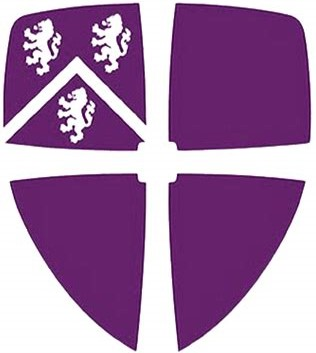

<!--
-->

 <h1 align = "center">Simon Ward: Portfolio </h1>
 
&emsp;&emsp;&emsp;&emsp;&emsp;&emsp;&emsp;&emsp;&emsp;&emsp;&emsp;&emsp;&emsp;&emsp;&emsp;&emsp;&emsp;&emsp;  

I am an applied data science researcher with prior industry experience eager to apply my knowledge of machine learning, statistical analysis, and other data science techniques to challenging and high impact business problems. I have a strong track record of leading teams of junior and senior colleagues, working on projects I curated and creating business value.

***

## Data Science Projects

Below are several data science projects, primarily focused on improving the performance (speed of response, stability, and sensitivity) of biosensors (sensors able to detect harmful biological molecules) for more effective medical diagnostics 🩺💉💊, food safety 🍇🍅🍌 and environmental monitoring 🌱🐟💧, to keep people around the world healthier and safer.

| ⏱️📈⏩ [Faster Sensor Response using Time Series Forecasting](https://github.com/SimonJWard/Response-Time-Reduction)| 👅🧠🔥 [Increased Sensor Stability using Machine Learning](https://github.com/SimonJWard/Capture-Agent-Free-Biosensing)|
| :-:| :-:| 
| | 

| 🔍🎯📏 [Enhanced Biosensor Detection Limits with Signal Processing](https://github.com/SimonJWard/Enhancing-Biosensor-Detection-Limits)| 💡🔀📚 [Inverse Design of Optical Structures using Deep Learning](https://github.com/SimonJWard/Optical-Structure-Inverse-Design)|
| :-:| :-:| 
| | 

***

## Resume 
For further details of my skills and experience, review the sections below, or see my resume:
📄 [__Simon-Ward-Resume__](https://github.com/.pdf)

***

## Education 

&ensp;[__Vanderbilt University__](https://www.vanderbilt.edu/) (Nashville, TN)&emsp;&emsp;&emsp;&emsp;&emsp;&emsp;&emsp;&emsp;&emsp;&emsp;&emsp;&emsp;&emsp;&emsp;&emsp;&emsp;&emsp;&emsp;&emsp;&emsp;&emsp;&emsp;&emsp;&emsp;&emsp;&emsp;&emsp;&emsp;&emsp;&emsp;&emsp;&emsp;&emsp;&emsp;2019 - 2024 (February)

&emsp;&emsp;&ensp;__PhD in Electrical and Computer Engineering__

 

&ensp;[__Durham University__](https://www.durham.ac.uk/) (Durham, UK)&emsp;&emsp;&emsp;&emsp;&emsp;&emsp;&emsp;&emsp;&emsp;&emsp;&emsp;&emsp;&emsp;&emsp;&emsp;&emsp;&emsp;&emsp;&emsp;&emsp;&emsp;&emsp;&emsp;&emsp;&emsp;&emsp;&emsp;&emsp;&emsp;&emsp;&emsp;&emsp;&emsp;&emsp;&emsp;&emsp;2014 - 2015

&emsp;&emsp;__Masters of Physics__

 

&ensp;[__Durham University__](https://www.durham.ac.uk/) (Durham, UK)&emsp;&emsp;&emsp;&emsp;&emsp;&emsp;&emsp;&emsp;&emsp;&emsp;&emsp;&emsp;&emsp;&emsp;&emsp;&emsp;&emsp;&emsp;&emsp;&emsp;&emsp;&emsp;&emsp;&emsp;&emsp;&emsp;&emsp;&emsp;&emsp;&emsp;&emsp;&emsp;&emsp;&emsp;&emsp;&emsp;2011 - 2014

&emsp;&emsp;__Bachelors of Physics__

***

## Engineering Experience 
__Research assistant__&emsp;&emsp;&emsp;&emsp;&emsp;&emsp;&emsp;&emsp;&emsp;&emsp;&emsp;&emsp;&emsp;&emsp;&emsp;&emsp;&emsp;&emsp;&emsp;&emsp;&emsp;&emsp;&emsp;&emsp;&emsp;&emsp;&emsp;&emsp;&emsp;&emsp;&emsp;&emsp;&emsp;&emsp;&emsp;&emsp;&emsp;&emsp;&emsp;&emsp;&emsp;&emsp;&emsp;&emsp;2019 - 2024

&ensp;[__Vanderbilt University__](https://www.vanderbilt.edu/) (Nashville, TN)

Investigating the use of machine learning and signal processing techniques to enhance performance and commercialization potential of biosensors.
- Devised approach to reduce sensor response time by a factor > 4, using ensembles of LSTM networks for time series forecasting, uncertainty estimation and out-of-distribution sample identification, enabling rapid medical diagnostic tests.
- Designed a capture agent-free biosensor using machine learning (dimensionality reduction, classification) applied to biosensor arrays, a step towards unprecedented low cost, robust and scalable point-of-care medical diagnostics.
- Developed Morlet wavelet phase signal processing method to improve detection limits by 10x for thin film sensors, using Morlet wavelet band pass filtering to remove noise.
- Built software (python) and hardware (stepper motor, laser cut plexiglass) to automate biosensor data collection, improving accuracy by 48% and increasing experimental throughput by 100x.

 

__Electronic Engineer__&emsp;&emsp;&emsp;&emsp;&emsp;&emsp;&emsp;&emsp;&emsp;&emsp;&emsp;&emsp;&emsp;&emsp;&emsp;&emsp;&emsp;&emsp;&emsp;&emsp;&emsp;&emsp;&emsp;&emsp;&emsp;&emsp;&emsp;&emsp;&emsp;&emsp;&emsp;&emsp;&emsp;&emsp;&emsp;&emsp;&emsp;&emsp;&emsp;&emsp;&emsp;&emsp;&emsp;&emsp;2015 - 2019

&ensp;[__Crowcon Detection Instruments Ltd.__](https://www.crowcon.com) (Abingdon, UK)

- Designed gas detector firmware (C), analogue and digital electronics for communications and running sensors, driving the companies push towards IoT capability, accelerating beyond competitors.
- Solved design flaws in existing products after troubleshooting customer problems under pressure and finding the root cause (ESD susceptibility, temperature drift), rescuing a £55,000 order of 150 units.
- Created test procedures for new products, designed software (Python), electronics, and mechanics for automated test jigs and audited test house, improving quality and increasing production yields by 5%.

 
                 		
__Research and Development Intern__&emsp;&emsp;&emsp;&emsp;&emsp;&emsp;&emsp;&emsp;&emsp;&emsp;&emsp;&emsp;&emsp;&emsp;&emsp;&emsp;&emsp;&emsp;&emsp;&emsp;&emsp;&emsp;&emsp;&emsp;&emsp;&emsp;(two summer internships) 2014 and 2015

&ensp;[__Crowcon Detection Instruments Ltd.__](https://www.crowcon.com) (Abingdon, UK)

- Formulated and performed experiments to test software and hardware of a gas detecting camera and designed electronics in intelligent junction box, collaborated with a team in a partner company abroad.

 
            		
__Research Assistant__&emsp;&emsp;&emsp;&emsp;&emsp;&emsp;&emsp;&emsp;&emsp;&emsp;&emsp;&emsp;&emsp;&emsp;&emsp;&emsp;&emsp;&emsp;&emsp;&emsp;&emsp;&emsp;&emsp;&emsp;&emsp;&emsp;&emsp;&emsp;&emsp;&emsp;&emsp;&emsp;&emsp;&emsp;&emsp;&emsp;&emsp;&emsp;&emsp;&emsp;&emsp;&emsp;&emsp;&emsp;2012 - 2015

&ensp;[__Durham University__](https://www.durham.ac.uk/) (Durham, UK)

- Modelled physics of planetary motion in the solar system using python, achieving 5% increase in speed compared to previous project solution.
- Probed molecular behaviour of surfactants using dual polarization interferometry, providing valuable insights for Procter and Gamble product development.
- Engineered pipeline defect testing solution using eddy currents with the potential to reduce operating costs by >20% and communicated findings to company stakeholders, in collaboration with GE.

 
            		
__Research and Development Intern__&emsp;&emsp;&emsp;&emsp;&emsp;&emsp;&emsp;&emsp;&emsp;&emsp;&emsp;&emsp;&emsp;&emsp;&emsp;&emsp;&emsp;&emsp;&emsp;&emsp;&emsp;&emsp;&emsp;&emsp;&emsp;&emsp;(summer internship) 2011

&ensp;[__Oxford Instruments__](https://www.oxinst.com/) (Abingdon, UK)

- Quantified vibration in cryogen-free superconducting magnet system with laser Doppler measurements.

***

## Skills

               

Experience using the following machine learning models:

* Linear Regression
* Logistic Regression
* Support Vector Machines (SVM)
* Random Forests (RF)
* K-Nearest Neighbors (KNN)
* Principal Components Analysis (PCA)
* Linear Discriminant Anlysis (LDA)
* Artificial Neural Networks (ANN)
* Recurrent Neural Networks (RNN)
* Gated Recurrent Unit (GRU)
* Long Short-Term Memory (LSTM)

***

## Leadership

***
## Values:

I value and prioritise model fairness, understanding the data collection process and empathy for end users, diversity (particularly in data science teams), and creating business value.

***

## Community Service

__Vanderbilt University Engineering School Ambassador__&emsp;&emsp;&emsp;&emsp;&emsp;&emsp;&emsp;&emsp;&emsp;&emsp;&emsp;&emsp;&emsp;&emsp;&emsp;&emsp;&emsp;&emsp;&emsp;&emsp;&emsp;&emsp;&emsp;&emsp;&emsp;&emsp;&emsp;&emsp;&emsp;&emsp;&emsp;&emsp;&emsp;&emsp;&emsp;&emsp;&emsp;&emsp;&emsp;&emsp;&emsp;&emsp;&emsp;&emsp;2019 - 2023

&ensp;[__Vanderbilt University__](https://www.vanderbilt.edu/) (Nashville, TN)

- Represented Vanderbilt school of engineering to external stakeholders in public online information sessions and several in-person events, sharing research and experiences at Vanderbilt.
- Ran 3 outreach events for summer academy high school students to encourage STEM participation.

 

__Assistant Foster Carer/Mentor__&emsp;&emsp;&emsp;&emsp;&emsp;&emsp;&emsp;&emsp;&emsp;&emsp;&emsp;&emsp;&emsp;&emsp;&emsp;&emsp;&emsp;&emsp;&emsp;&emsp;&emsp;&emsp;&emsp;&emsp;&emsp;&emsp;&emsp;&emsp;&emsp;&emsp;&emsp;&emsp;&emsp;&emsp;&emsp;&emsp;&emsp;&emsp;&emsp;&emsp;&emsp;&emsp;&emsp;&emsp;2015 - 2019

&ensp;[__Oxfordshire County Council Social and Health Care__](https://www.oxfordshire.gov.uk/residents/social-and-health-care) (Oxford, UK)

- Cared for disadvantaged foster children from newborn to twelve years old, aiding my parents who are full-time caregivers. These children faced a spectrum of difficulties, requiring specialized care.

 

__Church Volunteer__&emsp;&emsp;&emsp;&emsp;&emsp;&emsp;&emsp;&emsp;&emsp;&emsp;&emsp;&emsp;&emsp;&emsp;&emsp;&emsp;&emsp;&emsp;&emsp;&emsp;&emsp;&emsp;&emsp;&emsp;&emsp;&emsp;&emsp;&emsp;&emsp;&emsp;&emsp;&emsp;&emsp;&emsp;&emsp;&emsp;&emsp;&emsp;&emsp;&emsp;&emsp;&emsp;&emsp;&emsp;2016 - 2018

&ensp;[__St Aldates Church__](https://staldates.org.uk) (Oxford, UK)

- Prepared and served meals to the homeless population of Oxford

 

__Assistant Foster Carer/Mentor__&emsp;&emsp;&emsp;&emsp;&emsp;&emsp;&emsp;&emsp;&emsp;&emsp;&emsp;&emsp;&emsp;&emsp;&emsp;&emsp;&emsp;&emsp;&emsp;&emsp;&emsp;&emsp;&emsp;&emsp;&emsp;&emsp;&emsp;&emsp;&emsp;&emsp;&emsp;&emsp;&emsp;&emsp;&emsp;&emsp;&emsp;&emsp;&emsp;&emsp;&emsp;&emsp;&emsp;&emsp;2015 - 2019

&ensp;[__Oxfordshire County Council Social and Health Care__](https://staldates.org.uk) (Oxford, UK)

- Cared for disadvantaged foster children from newborn to twelve years old, aiding my parents who are full-time caregivers. These children faced a spectrum of difficulties, requiring specialized care.

***

Below are some of the ways to connect, please feel free to reach out with any questions, comments, or opportunities.

🖇 __LinkedIn:__ __linkedin.com/in/simon-j-ward/__

📫 __Email:__ __Simon.J.Ward@outlook.com__
